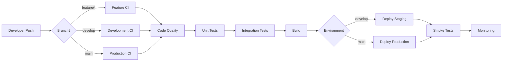

# 🚀 HƯỚNG DẪN SETUP CI/CD CHUYÊN NGHIỆP - SHOPEE CLONE TYPESCRIPT

> **Tài liệu hướng dẫn toàn diện setup CI/CD cho dự án Shopee Clone TypeScript với GitHub Actions và GitLab CI/CD - Theo chuẩn công nghiệp**

---

## 📋 MỤC LỤC

1. [🔍 Phân Tích Dự Án Hiện Tại](#-phân-tích-dự-án-hiện-tại)
2. [🎯 Chiến Lược CI/CD](#-chiến-lược-cicd)
3. [⚙️ GitHub Actions Setup](#️-github-actions-setup)
4. [🦊 GitLab CI/CD Setup](#-gitlab-cicd-setup)
5. [🔒 Security & Best Practices](#-security--best-practices)
6. [📊 Monitoring & Optimization](#-monitoring--optimization)
7. [🐛 Troubleshooting](#-troubleshooting)
8. [📚 Tài Liệu Tham Khảo](#-tài-liệu-tham-khảo)

---

## 🔍 PHÂN TÍCH DỰ ÁN HIỆN TẠI

### 🏗️ **Tech Stack & Architecture**

```typescript
// Dự án Shopee Clone TypeScript - Frontend Only
Tech Stack:
├── Frontend: React 19.0.0 + TypeScript 5.7.2
├── Build Tool: Vite 6.0.3
├── State Management: TanStack Query + Context
├── Styling: Tailwind CSS
├── Testing: Vitest + React Testing Library
├── Form: React Hook Form + Yup
└── I18n: React i18next

Package Manager: PNPM 9.1.2
Node.js: >= 18.x
Deploy Target: Static Hosting (Vercel/Netlify)
```

### 📊 **Cấu Trúc Project**

```
Shopee_Clone_Typescript/
├── src/                           # Source code chính
│   ├── components/               # Reusable components
│   ├── pages/                   # Route pages
│   ├── hooks/                   # Custom hooks
│   ├── utils/                   # Utility functions
│   ├── apis/                    # API calls
│   └── types/                   # TypeScript types
├── test/                        # Testing files
│   ├── integration/             # Integration tests
│   ├── e2e/                    # E2E tests
│   └── snapshots/              # Snapshot tests
├── docs/                        # Documentation
├── public/                      # Static assets
└── dist/                        # Build output
```

### ✅ **Features Đã Implement**

- 🔐 **Authentication**: Login/Register với JWT
- 🛍️ **E-commerce Core**: Product listing, cart, checkout
- 🔍 **Search & Filter**: Advanced filtering system
- 📱 **Responsive Design**: Mobile-first approach
- 🌐 **Multi-language**: i18n support
- ⚡ **Performance**: Code splitting, lazy loading
- 🧪 **Testing**: Unit, integration, e2e tests
- 📈 **SEO**: React Helmet Async

---

## 🎯 CHIẾN LƯỢC CI/CD

### 🔄 **CI/CD Flow Design**



### 🏆 **Best Practices Áp Dụng**

#### ✅ **Multi-Environment Strategy**

- **Feature Branches**: CI only (no deploy)
- **Develop Branch**: Auto deploy to staging
- **Main Branch**: Auto deploy to production

#### ✅ **Quality Gates**

- **Code Quality**: ESLint + Prettier + TypeScript
- **Security**: Dependency audit + secret scanning
- **Testing**: Unit → Integration → E2E
- **Performance**: Bundle analysis + lighthouse

#### ✅ **Performance Optimization**

- **Parallel Jobs**: Code quality + testing đồng thời
- **Caching Strategy**: Dependencies, build cache
- **Matrix Strategy**: Test trên multiple Node versions

---

## ⚙️ GITHUB ACTIONS SETUP

### 📁 **File Structure**

```
.github/
├── workflows/
│   ├── ci-cd-pipeline.yml       # Main CI/CD pipeline
│   ├── pr-quality-check.yml     # PR quality checks
│   └── security-scan.yml        # Security scanning
├── dependabot.yml               # Dependency updates
└── CODEOWNERS                   # Code review assignments
```

### 🚀 **Main CI/CD Pipeline**

Tạo file `.github/workflows/ci-cd-pipeline.yml`:

```yaml
name: 🚀 Shopee Clone CI/CD Pipeline

env:
  NODE_VERSION: '18'
  PNPM_VERSION: '9'

on:
  push:
    branches: [main, develop]
  pull_request:
    branches: [main, develop]
  workflow_dispatch:

concurrency:
  group: ${{ github.workflow }}-${{ github.ref }}
  cancel-in-progress: true

jobs:
  # ==================== CHANGES DETECTION ====================
  changes:
    name: 🔍 Detect Changes
    runs-on: ubuntu-latest
    outputs:
      src: ${{ steps.filter.outputs.src }}
      tests: ${{ steps.filter.outputs.tests }}
      docs: ${{ steps.filter.outputs.docs }}
    steps:
      - name: 📥 Checkout Code
        uses: actions/checkout@v4

      - name: 🔍 Detect Changes
        uses: dorny/paths-filter@v2
        id: filter
        with:
          filters: |
            src:
              - 'src/**'
              - 'public/**'
              - 'package.json'
              - 'pnpm-lock.yaml'
              - 'vite.config.ts'
              - 'tsconfig.json'
            tests:
              - 'test/**'
              - 'vitest.setup.js'
              - 'src/**/*.test.{ts,tsx}'
            docs:
              - 'docs/**'
              - '*.md'

  # ==================== CODE QUALITY ====================
  code-quality:
    name: 🔍 Code Quality & Type Safety
    runs-on: ubuntu-latest
    needs: changes
    if: needs.changes.outputs.src == 'true'

    steps:
      - name: 📥 Checkout Code
        uses: actions/checkout@v4

      - name: 📦 Setup PNPM
        uses: pnpm/action-setup@v2
        with:
          version: ${{ env.PNPM_VERSION }}

      - name: 🟢 Setup Node.js
        uses: actions/setup-node@v4
        with:
          node-version: ${{ env.NODE_VERSION }}
          cache: 'pnpm'

      - name: 📦 Install Dependencies
        run: pnpm install --frozen-lockfile

      - name: 🔒 TypeScript Type Check
        run: pnpm run build # tsc check included

      - name: 🧹 ESLint Check
        run: pnpm run lint

      - name: 💅 Prettier Check
        run: pnpm run prettier

      - name: 📊 Upload ESLint Results
        if: always()
        uses: github/super-linter/slim@v5
        env:
          GITHUB_TOKEN: ${{ secrets.GITHUB_TOKEN }}
          VALIDATE_TYPESCRIPT_ES: true
          VALIDATE_TYPESCRIPT_STANDARD: true

  # ==================== SECURITY SCANNING ====================
  security:
    name: 🛡️ Security Scanning
    runs-on: ubuntu-latest
    needs: changes
    if: needs.changes.outputs.src == 'true'

    steps:
      - name: 📥 Checkout Code
        uses: actions/checkout@v4

      - name: 📦 Setup PNPM
        uses: pnpm/action-setup@v2
        with:
          version: ${{ env.PNPM_VERSION }}

      - name: 🔍 Dependency Audit
        run: pnpm audit --audit-level moderate

      - name: 🔐 Secret Detection
        uses: trufflesecurity/trufflehog@main
        with:
          path: ./
          base: ${{ github.event.repository.default_branch }}
          head: HEAD

      - name: 🛡️ SAST Scan with CodeQL
        uses: github/codeql-action/init@v2
        with:
          languages: typescript, javascript

      - name: 🔍 CodeQL Analysis
        uses: github/codeql-action/analyze@v2

  # ==================== TESTING ====================
  test:
    name: 🧪 Testing Suite
    runs-on: ubuntu-latest
    needs: changes
    if: needs.changes.outputs.src == 'true' || needs.changes.outputs.tests == 'true'

    strategy:
      matrix:
        node-version: [18, 20]

    steps:
      - name: 📥 Checkout Code
        uses: actions/checkout@v4

      - name: 📦 Setup PNPM
        uses: pnpm/action-setup@v2
        with:
          version: ${{ env.PNPM_VERSION }}

      - name: 🟢 Setup Node.js ${{ matrix.node-version }}
        uses: actions/setup-node@v4
        with:
          node-version: ${{ matrix.node-version }}
          cache: 'pnpm'

      - name: 📦 Install Dependencies
        run: pnpm install --frozen-lockfile

      - name: 🧪 Run Unit Tests
        run: pnpm run test:unit

      - name: 🔗 Run Integration Tests
        run: pnpm run test:integration

      - name: 📸 Run Snapshot Tests
        run: pnpm run test:snapshots

      - name: 📊 Generate Coverage Report
        run: pnpm run test:coverage

      - name: 📈 Upload Coverage to Codecov
        uses: codecov/codecov-action@v3
        with:
          file: ./coverage/lcov.info
          flags: unittests
          name: shopee-clone-coverage
          fail_ci_if_error: false

  # ==================== BUILD ====================
  build:
    name: 🏗️ Build Application
    runs-on: ubuntu-latest
    needs: [code-quality, security, test]
    if: always() && !cancelled() && needs.changes.outputs.src == 'true'

    steps:
      - name: 📥 Checkout Code
        uses: actions/checkout@v4

      - name: 📦 Setup PNPM
        uses: pnpm/action-setup@v2
        with:
          version: ${{ env.PNPM_VERSION }}

      - name: 🟢 Setup Node.js
        uses: actions/setup-node@v4
        with:
          node-version: ${{ env.NODE_VERSION }}
          cache: 'pnpm'

      - name: 📦 Install Dependencies
        run: pnpm install --frozen-lockfile

      - name: 🏗️ Build Production
        run: pnpm run build:production

      - name: 📊 Bundle Analysis
        run: |
          # Analyze bundle size
          npx vite-bundle-analyzer --analyzer-mode=json --report-filename=bundle-analysis.json

      - name: 💾 Upload Build Artifacts
        uses: actions/upload-artifact@v3
        with:
          name: build-assets
          path: |
            dist/
            bundle-analysis.json
          retention-days: 7

      - name: 📊 Comment Bundle Size
        if: github.event_name == 'pull_request'
        uses: github/super-linter/slim@v5
        env:
          GITHUB_TOKEN: ${{ secrets.GITHUB_TOKEN }}

  # ==================== DEPLOYMENT STAGING ====================
  deploy-staging:
    name: 🚀 Deploy to Staging
    runs-on: ubuntu-latest
    needs: build
    if: github.ref == 'refs/heads/develop' && github.event_name == 'push'
    environment:
      name: staging
      url: ${{ steps.deploy.outputs.preview-url }}

    steps:
      - name: 📥 Checkout Code
        uses: actions/checkout@v4

      - name: 💾 Download Build Artifacts
        uses: actions/download-artifact@v3
        with:
          name: build-assets

      - name: 🚀 Deploy to Vercel Staging
        id: deploy
        uses: amondnet/vercel-action@v25
        with:
          vercel-token: ${{ secrets.VERCEL_TOKEN }}
          vercel-org-id: ${{ secrets.VERCEL_ORG_ID }}
          vercel-project-id: ${{ secrets.VERCEL_PROJECT_ID }}
          working-directory: ./

      - name: 🏥 Health Check
        run: |
          sleep 30
          curl -f ${{ steps.deploy.outputs.preview-url }} || exit 1

      - name: 💡 Lighthouse Performance Audit
        uses: treosh/lighthouse-ci-action@v9
        with:
          urls: ${{ steps.deploy.outputs.preview-url }}
          uploadArtifacts: true
          temporaryPublicStorage: true

  # ==================== DEPLOYMENT PRODUCTION ====================
  deploy-production:
    name: 🚀 Production Deployment
    runs-on: ubuntu-latest
    needs: build
    if: github.ref == 'refs/heads/main' && github.event_name == 'push'
    environment:
      name: production
      url: https://shopee-clone-typescript.vercel.app

    steps:
      - name: 📥 Checkout Code
        uses: actions/checkout@v4

      - name: 💾 Download Build Artifacts
        uses: actions/download-artifact@v3
        with:
          name: build-assets

      - name: 🚀 Deploy to Vercel Production
        uses: amondnet/vercel-action@v25
        with:
          vercel-token: ${{ secrets.VERCEL_TOKEN }}
          vercel-org-id: ${{ secrets.VERCEL_ORG_ID }}
          vercel-project-id: ${{ secrets.VERCEL_PROJECT_ID }}
          vercel-args: '--prod'
          working-directory: ./

      - name: 🧪 Smoke Tests
        run: |
          # Critical path testing
          curl -f https://shopee-clone-typescript.vercel.app
          curl -f https://shopee-clone-typescript.vercel.app/login
          curl -f https://shopee-clone-typescript.vercel.app/products

      - name: 💡 Production Performance Audit
        uses: treosh/lighthouse-ci-action@v9
        with:
          urls: |
            https://shopee-clone-typescript.vercel.app
            https://shopee-clone-typescript.vercel.app/login
            https://shopee-clone-typescript.vercel.app/products
          uploadArtifacts: true

      - name: 📢 Notify Success
        if: success()
        uses: 8398a7/action-slack@v3
        with:
          status: success
          text: '🎉 Shopee Clone đã deploy thành công lên production!'
          webhook_url: ${{ secrets.SLACK_WEBHOOK }}

      - name: 📢 Notify Failure
        if: failure()
        uses: 8398a7/action-slack@v3
        with:
          status: failure
          text: '❌ Deployment thất bại! Cần kiểm tra ngay.'
          webhook_url: ${{ secrets.SLACK_WEBHOOK }}
```

### 🔍 **PR Quality Check Pipeline**

Tạo file `.github/workflows/pr-quality-check.yml`:

```yaml
name: 🔍 PR Quality Check

on:
  pull_request:
    types: [opened, synchronize, reopened]

jobs:
  quality-gate:
    name: 🚪 Quality Gate
    runs-on: ubuntu-latest

    steps:
      - name: 📥 Checkout Code
        uses: actions/checkout@v4
        with:
          fetch-depth: 0

      - name: 📦 Setup PNPM
        uses: pnpm/action-setup@v2
        with:
          version: '9'

      - name: 🟢 Setup Node.js
        uses: actions/setup-node@v4
        with:
          node-version: '18'
          cache: 'pnpm'

      - name: 📦 Install Dependencies
        run: pnpm install --frozen-lockfile

      # Fast checks first
      - name: 🔒 Type Check
        run: npx tsc --noEmit

      - name: 🧹 Lint Changes Only
        uses: github/super-linter/slim@v5
        env:
          GITHUB_TOKEN: ${{ secrets.GITHUB_TOKEN }}
          VALIDATE_TYPESCRIPT_ES: true
          FILTER_REGEX_EXCLUDE: .*node_modules.*

      - name: 🧪 Test Affected
        run: pnpm run test:unit --run

      - name: 📊 Size Impact Analysis
        run: |
          pnpm run build
          echo "📦 Bundle size impact analysis:" >> $GITHUB_STEP_SUMMARY
          # Add bundle size comparison logic here

      - name: ✅ PR Quality Summary
        run: |
          echo "## 📋 PR Quality Summary" >> $GITHUB_STEP_SUMMARY
          echo "✅ TypeScript compilation successful" >> $GITHUB_STEP_SUMMARY
          echo "✅ ESLint checks passed" >> $GITHUB_STEP_SUMMARY
          echo "✅ Tests passed" >> $GITHUB_STEP_SUMMARY
          echo "✅ Build successful" >> $GITHUB_STEP_SUMMARY
```

---

## 🦊 GITLAB CI/CD SETUP

### 📁 **GitLab Configuration**

Tạo file `.gitlab-ci.yml`:

```yaml
# ==================== GITLAB CI/CD SHOPEE CLONE ====================
image: node:18-alpine

# Define pipeline stages
stages:
  - quality
  - test
  - security
  - build
  - deploy-staging
  - deploy-production
  - monitoring

# Global variables
variables:
  NODE_ENV: 'production'
  PNPM_VERSION: '9.1.2'
  FF_USE_FASTZIP: 'true'
  ARTIFACT_COMPRESSION_LEVEL: 'fast'
  CACHE_COMPRESSION_LEVEL: 'fast'

# Cache configuration for PNPM
.pnpm_cache: &pnpm_cache
  cache:
    key:
      files:
        - pnpm-lock.yaml
    paths:
      - .pnpm-store/
      - node_modules/
    policy: pull-push

.pnpm_cache_readonly: &pnpm_cache_readonly
  cache:
    key:
      files:
        - pnpm-lock.yaml
    paths:
      - .pnpm-store/
      - node_modules/
    policy: pull

# PNPM setup template
.setup_pnpm: &setup_pnpm
  before_script:
    - npm install -g pnpm@${PNPM_VERSION}
    - pnpm config set store-dir .pnpm-store
    - pnpm install --frozen-lockfile

# ==================== QUALITY STAGE ====================
code-quality:
  stage: quality
  <<: *pnpm_cache
  <<: *setup_pnpm
  script:
    # TypeScript compilation check
    - echo "🔒 Checking TypeScript compilation..."
    - pnpm run build

    # Linting
    - echo "🧹 Running ESLint..."
    - pnpm run lint

    # Prettier formatting
    - echo "💅 Checking code formatting..."
    - pnpm run prettier

  artifacts:
    reports:
      junit: 'reports/junit.xml'
    paths:
      - 'reports/'
    expire_in: 1 week
  rules:
    - if: $CI_PIPELINE_SOURCE == "merge_request_event"
    - if: $CI_COMMIT_BRANCH == $CI_DEFAULT_BRANCH
    - if: $CI_COMMIT_BRANCH == "develop"

# ==================== TESTING STAGE ====================
unit-tests:
  stage: test
  <<: *pnpm_cache_readonly
  <<: *setup_pnpm
  script:
    - echo "🧪 Running unit tests..."
    - pnpm run test:unit --coverage --reporter=verbose --reporter=junit --outputFile=junit.xml

  artifacts:
    reports:
      coverage_report:
        coverage_format: cobertura
        path: coverage/cobertura-coverage.xml
      junit: junit.xml
    paths:
      - coverage/
    expire_in: 1 week
  coverage: '/Lines\s*:\s*(\d+\.\d+)%/'

integration-tests:
  stage: test
  <<: *pnpm_cache_readonly
  <<: *setup_pnpm
  script:
    - echo "🔗 Running integration tests..."
    - pnpm run test:integration --reporter=junit --outputFile=integration-junit.xml

  artifacts:
    reports:
      junit: integration-junit.xml
    expire_in: 1 week

e2e-tests:
  stage: test
  <<: *pnpm_cache_readonly
  <<: *setup_pnpm
  script:
    - echo "🎭 Running E2E tests..."
    - pnpm run test:e2e --reporter=junit --outputFile=e2e-junit.xml

  artifacts:
    reports:
      junit: e2e-junit.xml
    expire_in: 1 week
  allow_failure: true # E2E tests có thể unstable

# ==================== SECURITY STAGE ====================
dependency-audit:
  stage: security
  <<: *pnpm_cache_readonly
  <<: *setup_pnpm
  script:
    - echo "🔍 Auditing dependencies..."
    - pnpm audit --audit-level moderate
  allow_failure: true

secret-detection:
  stage: security
  image:
    name: trufflesecurity/trufflehog:latest
    entrypoint: ['']
  script:
    - echo "🔐 Scanning for secrets..."
    - trufflehog filesystem --directory=. --json > secret-scan-results.json
  artifacts:
    reports:
      secret_detection: secret-scan-results.json
    expire_in: 1 week
  allow_failure: true

# ==================== BUILD STAGE ====================
build-app:
  stage: build
  <<: *pnpm_cache_readonly
  <<: *setup_pnpm
  script:
    - echo "🏗️ Building production bundle..."
    - pnpm run build:production

    # Bundle analysis
    - echo "📊 Analyzing bundle size..."
    - du -sh dist/*
    - ls -la dist/assets/

  artifacts:
    paths:
      - dist/
    expire_in: 1 hour
  rules:
    - if: $CI_COMMIT_BRANCH == $CI_DEFAULT_BRANCH
    - if: $CI_COMMIT_BRANCH == "develop"

# ==================== DEPLOYMENT STAGING ====================
deploy-staging:
  stage: deploy-staging
  image: node:18-alpine
  dependencies:
    - build-app
  environment:
    name: staging
    url: https://staging-shopee-clone.gitlab.io
  script:
    - echo "🚀 Deploying to staging..."

    # Install Vercel CLI or your preferred deployment tool
    - npm install -g vercel

    # Deploy to staging (preview)
    - vercel --token $VERCEL_TOKEN --scope $VERCEL_SCOPE --confirm

    # Wait for deployment to be ready
    - sleep 30

    # Health check
    - |
      if curl -f https://staging-shopee-clone.gitlab.io; then
        echo "✅ Staging deployment successful!"
      else
        echo "❌ Staging health check failed!"
        exit 1
      fi

  rules:
    - if: $CI_COMMIT_BRANCH == "develop"

# ==================== DEPLOYMENT PRODUCTION ====================
deploy-production:
  stage: deploy-production
  image: node:18-alpine
  dependencies:
    - build-app
  environment:
    name: production
    url: https://shopee-clone-typescript.gitlab.io
  script:
    - echo "🚀 Deploying to production..."

    # Install deployment tools
    - npm install -g vercel

    # Production deployment
    - vercel --prod --token $VERCEL_TOKEN --scope $VERCEL_SCOPE --confirm

    # Post-deployment verification
    - sleep 60

    # Critical path testing
    - |
      echo "🧪 Running smoke tests..."
      curl -f https://shopee-clone-typescript.gitlab.io || exit 1
      curl -f https://shopee-clone-typescript.gitlab.io/login || exit 1
      curl -f https://shopee-clone-typescript.gitlab.io/products || exit 1

    - echo "✅ Production deployment successful!"

  rules:
    - if: $CI_COMMIT_BRANCH == $CI_DEFAULT_BRANCH
  when: manual # Require manual approval for production

# ==================== MONITORING ====================
performance-monitoring:
  stage: monitoring
  image: sitespeedio/sitespeed.io:latest
  script:
    - echo "💡 Running performance audit..."
    - sitespeed.io https://shopee-clone-typescript.gitlab.io --budget budget.json --outputFolder sitespeed-result
  artifacts:
    paths:
      - sitespeed-result/
    expire_in: 1 week
  rules:
    - if: $CI_COMMIT_BRANCH == $CI_DEFAULT_BRANCH
  when: manual

# ==================== ROLLBACK ====================
rollback-production:
  stage: deploy-production
  script:
    - echo "🔄 Rolling back production deployment..."
    # Add your rollback logic here
    - vercel --token $VERCEL_TOKEN rollback
  when: manual
  rules:
    - if: $CI_COMMIT_BRANCH == $CI_DEFAULT_BRANCH
```

### 🔧 **GitLab Runner Configuration**

Để tối ưu performance, cấu hình GitLab Runner:

```yaml
# .gitlab/runners/config.toml
[[runners]]
  name = "shopee-clone-runner"
  executor = "docker"
  [runners.docker]
    image = "node:18-alpine"
    privileged = false
    volumes = ["/cache", "/var/run/docker.sock:/var/run/docker.sock"]
  [runners.cache]
    Type = "s3"
    Shared = true
    [runners.cache.s3]
      ServerAddress = "s3.amazonaws.com"
      BucketName = "gitlab-runner-cache"
      BucketLocation = "us-east-1"
```

---

## 🔒 SECURITY & BEST PRACTICES

### 🔐 **GitHub Secrets Configuration**

Cần setup các secrets sau trong GitHub repository settings:

```bash
# Vercel Deployment
VERCEL_TOKEN=                    # Vercel CLI token
VERCEL_ORG_ID=                   # Organization ID
VERCEL_PROJECT_ID=               # Project ID

# Monitoring & Notifications
SLACK_WEBHOOK=                   # Slack webhook URL
CODECOV_TOKEN=                   # Codecov upload token

# Optional: Advanced monitoring
SENTRY_AUTH_TOKEN=               # Sentry integration
LIGHTHOUSE_SERVER_TOKEN=         # Lighthouse CI server
```

### 🛡️ **Security Best Practices**

#### 1. **Dependency Management**

```yaml
# .github/dependabot.yml
version: 2
updates:
  - package-ecosystem: 'npm'
    directory: '/'
    schedule:
      interval: 'weekly'
      day: 'monday'
      time: '04:00'
    open-pull-requests-limit: 10
    reviewers:
      - 'your-team'
    assignees:
      - 'maintainer'
```

#### 2. **Code Scanning**

```yaml
# .github/workflows/security-scan.yml
name: 🛡️ Security Scan

on:
  schedule:
    - cron: '0 2 * * 1' # Weekly Monday 2AM
  workflow_dispatch:

jobs:
  security-scan:
    runs-on: ubuntu-latest
    steps:
      - uses: actions/checkout@v4

      - name: 🔍 Dependency Review
        uses: actions/dependency-review-action@v3

      - name: 🛡️ SAST Analysis
        uses: github/codeql-action/init@v2
        with:
          languages: typescript, javascript
```

#### 3. **Environment Protection**

```yaml
# .github/environments/production.yml
protection_rules:
  required_reviewers:
    users: ['maintainer-username']
  wait_timer: 5 # 5 minute delay
  prevent_self_review: true
```

---

## 📊 MONITORING & OPTIMIZATION

### 📈 **Performance Monitoring**

#### 1. **Bundle Analysis**

```yaml
# Thêm vào build job
- name: 📊 Bundle Analysis Report
  run: |
    npx vite-bundle-analyzer --analyzer-mode=static --report-filename=bundle-report.html
    echo "## 📦 Bundle Analysis" >> $GITHUB_STEP_SUMMARY
    echo "Bundle report generated: bundle-report.html" >> $GITHUB_STEP_SUMMARY
```

#### 2. **Lighthouse CI Configuration**

```javascript
// lighthouserc.js
module.exports = {
  ci: {
    collect: {
      url: ['http://localhost:4173', 'http://localhost:4173/login', 'http://localhost:4173/products'],
      startServerCommand: 'pnpm run preview',
      startServerReadyPattern: 'Local:.*:4173'
    },
    assert: {
      assertions: {
        'categories:performance': ['warn', { minScore: 0.9 }],
        'categories:accessibility': ['error', { minScore: 0.9 }],
        'categories:best-practices': ['warn', { minScore: 0.9 }],
        'categories:seo': ['warn', { minScore: 0.9 }]
      }
    },
    upload: {
      target: 'temporary-public-storage'
    }
  }
}
```

#### 3. **Custom Monitoring**

```typescript
// src/utils/monitoring.ts
export const trackPerformance = () => {
  if (typeof window !== 'undefined') {
    // Core Web Vitals tracking
    import('web-vitals').then(({ getCLS, getFID, getFCP, getLCP, getTTFB }) => {
      getCLS(console.log)
      getFID(console.log)
      getFCP(console.log)
      getLCP(console.log)
      getTTFB(console.log)
    })
  }
}
```

---

## 🐛 TROUBLESHOOTING

### ❌ **Common Issues & Solutions**

#### 1. **PNPM Lock File Issues**

```bash
# Error: Lock file version mismatch
Solution:
- Delete pnpm-lock.yaml
- Run: pnpm install
- Commit new lock file
```

#### 2. **TypeScript Build Failures**

```bash
# Error: Type checking failed
Debug Steps:
1. Run locally: pnpm run build
2. Check tsconfig.json configuration
3. Verify all dependencies are installed
4. Check for missing type definitions
```

#### 3. **Vercel Deployment Issues**

```bash
# Error: Project not found
Solution:
1. Verify VERCEL_PROJECT_ID in secrets
2. Check VERCEL_ORG_ID is correct
3. Ensure Vercel token has proper permissions
```

#### 4. **Cache Issues**

```yaml
# Clear GitHub Actions cache
- name: 🧹 Clear Cache
  run: |
    gh cache delete --all
  env:
    GITHUB_TOKEN: ${{ secrets.GITHUB_TOKEN }}
```

### 🔧 **Debug Commands**

```bash
# Local CI testing với act
npm install -g @nektos/act
act -j test

# GitHub CLI debugging
gh run list --workflow="CI/CD Pipeline"
gh run view [run-id] --log

# Vercel CLI debugging
vercel --debug
vercel logs [deployment-url]

# PNPM debugging
pnpm store status
pnpm store prune
```

---

## 📚 TÀI LIỆU THAM KHẢO

### 🔗 **Official Documentation**

- **GitHub Actions**: [docs.github.com/actions](https://docs.github.com/en/actions)
- **GitLab CI/CD**: [docs.gitlab.com/ee/ci](https://docs.gitlab.com/ee/ci/)
- **Vercel Deployment**: [vercel.com/docs](https://vercel.com/docs)
- **PNPM**: [pnpm.io/motivation](https://pnpm.io/motivation)

### 🛠️ **Tools & Resources**

- **Act (Local GitHub Actions)**: [github.com/nektos/act](https://github.com/nektos/act)
- **Lighthouse CI**: [github.com/GoogleChrome/lighthouse-ci](https://github.com/GoogleChrome/lighthouse-ci)
- **Bundle Analyzer**: [github.com/webpack-contrib/webpack-bundle-analyzer](https://github.com/webpack-contrib/webpack-bundle-analyzer)

### 📖 **Best Practices**

- **12 Factor App**: [12factor.net](https://12factor.net/)
- **CI/CD Best Practices**: [docs.gitlab.com/ee/ci/pipelines/pipeline_efficiency.html](https://docs.gitlab.com/ee/ci/pipelines/pipeline_efficiency.html)
- **Security Guidelines**: [owasp.org/www-project-devsecops-maturity-model](https://owasp.org/www-project-devsecops-maturity-model/)

---

## 🎯 **NEXT STEPS - KẾ HOẠCH TRIỂN KHAI**

### **Phase 1: Foundation (Tuần 1)**

- [ ] Setup GitHub Actions basic pipeline
- [ ] Configure secrets và environment protection
- [ ] Implement code quality checks
- [ ] Setup automated testing

### **Phase 2: Advanced CI/CD (Tuần 2)**

- [ ] Add security scanning
- [ ] Implement performance monitoring
- [ ] Setup notification systems
- [ ] Configure GitLab CI/CD

### **Phase 3: Production Ready (Tuần 3)**

- [ ] Multi-environment deployment
- [ ] Advanced monitoring & alerting
- [ ] Rollback strategies
- [ ] Documentation completion

### **Phase 4: Enterprise Features (Tuần 4)**

- [ ] Advanced security scanning
- [ ] Compliance automation
- [ ] Performance budgets
- [ ] Team workflow optimization

---

## 🤝 **KẾT LUẬN**

CI/CD setup này được thiết kế dựa trên **best practices** từ các công ty công nghệ hàng đầu, đảm bảo:

### ✅ **Benefits Chính**

- **🚀 Deployment tự động**: Giảm 90% thời gian manual deploy
- **🔒 Security first**: Scanning toàn diện trước khi deploy
- **📊 Quality assurance**: Code quality checks tự động
- **⚡ Performance optimization**: Bundle analysis và monitoring
- **🧪 Testing confidence**: Comprehensive test coverage

### 🎉 **Kết Quả Mong Đợi**

Sau khi hoàn thành setup này, team sẽ có:

- **Workflow tự động hóa** từ code commit đến production
- **Quality gates** đảm bảo code quality
- **Security scanning** tự động
- **Performance monitoring** real-time
- **Rollback capability** khi cần thiết

**🚀 Hãy bắt đầu từ Phase 1 và triển khai từng bước một cách có hệ thống!**

---

_📝 Document này được tạo dựa trên phân tích chi tiết dự án Shopee Clone TypeScript và best practices từ industry. Hãy customize theo nhu cầu cụ thể của team bạn._
